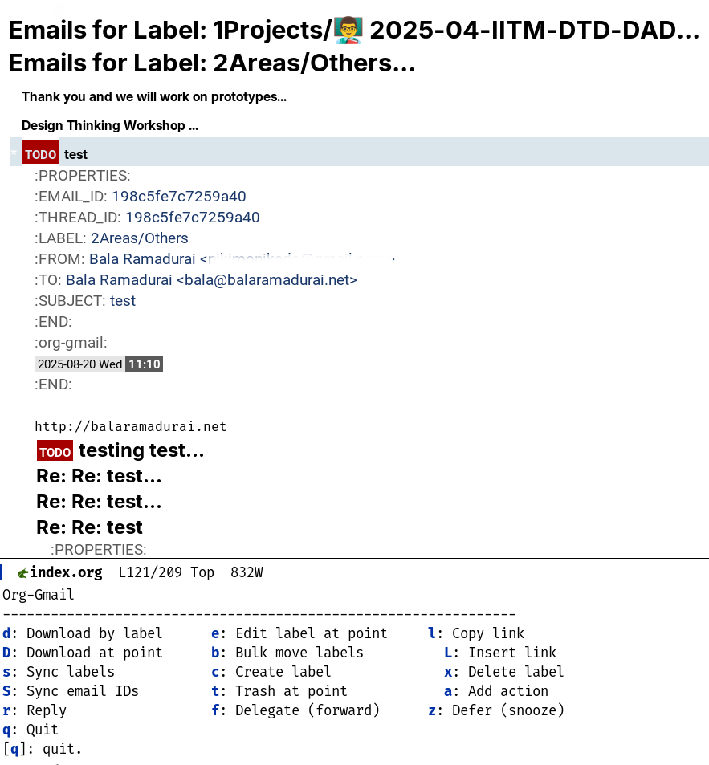

#+TITLE: org-gmail v2.0: Gmail Triage Inside Emacs

* Why org-gmail?

You love Org Mode. You tolerate email. What if triage happened where real work does?

** The Problem

- You already have a great email client (Gmail's web UI is fast)
- You already have a great task/knowledge system (Org Mode)
- But triaging email means context-switching out of Org every time
- Existing solutions (Gnus, mu4e, notmuch) want to BE your email client — 500+ lines of config, all or nothing

** The Solution

=org-gmail= is a *bridge*, not a replacement.

- *v1.x:* Pull threads into Org by Gmail label. Process them there.
- *v2.0:* Open a live triage feed inside Emacs. Flag emails with 4D actions (dired-style). Press =x= to execute them all — captures go to Org, Gmail state syncs automatically.

You stay in Emacs. Email stays in Gmail. They stay in sync.

** Who Is This For?

- GTD practitioners who want to process email without leaving Org
- P.A.R.A. users who want Gmail labels mirroring their folder structure
- Anyone running multiple Gmail accounts who wants a unified triage view

#+begin_quote
org-gmail v2.0: Triage email like you manage files in dired.
#+end_quote

* What's New in v2.0

** Live Triage Feed

=org-gmail-feed= opens a live inbox view — no labels, no downloads needed. Emails appear as browsable entries. Navigate with =n=/=p=, open full detail with =RET= (or split view with =TAB=).

** 4Ds Flagging (dired-style)

Flag entries with single-key actions, execute them all at once with =x=:

| Key | Flag | What happens on =x=                                        |
|-----+------+------------------------------------------------------------|
| =c= | =C= (green)  | Capture as TODO; prompt for task note                |
| =e= | =E= (cyan)   | Capture with SCHEDULED date; prompt for task note    |
| =d= | =D= (red)    | Trash in Gmail                                       |
| =a= | =a= (gray)   | Archive in Gmail (mark-read + remove from inbox)     |
| =A= | =A= (gold)   | Delegate: forward + capture; prompt for recipient    |
| =f= | =F= (blue)   | Refile: pick target now, capture + refile on =x=    |
| =r= | —            | Reply immediately (not a deferred flag)              |
| =u= | —            | Unflag the entry                                     |

Pressing =x= shows a summary ("Execute 3 actions: 2 Do/capture, 1 Delete?") before proceeding.

** Gmail State Sync

Every 4D action syncs state back to Gmail automatically — no separate step:

| Action   | Gmail effect                              |
|----------+-------------------------------------------|
| Do / Defer / Refile | mark-read + archive             |
| Delete   | move to trash                             |
| Archive  | mark-read + remove from inbox             |
| Delegate | star + mark-read + archive; forward email |

** Task Notes

When flagging Do (=c=), Defer (=e=), or Delegate (=A=), you are prompted for an optional note. If you write one, it becomes the =* TODO= heading and the email drops to a sub-heading underneath:

#+BEGIN_SRC org
,* TODO Review pricing proposal   :email:
  SCHEDULED: <2026-05-15 Thu>
  :PROPERTIES:
  :THREAD_ID: 189abc...
  :FROM:      vendor@company.com
  :END:

,** Q2 Pricing Update
   From: vendor@company.com
   https://mail.google.com/...

   Here are the updated rates...
#+END_SRC

Leave the note blank to use the email subject as the heading (v1.x behavior).

** Integrated Multi-Account Inbox

=org-gmail-feed-all= fetches all configured accounts in parallel and shows them in one buffer. Each email is labeled with a colored account badge (=‹bala›=, =‹niki›=, =‹spirelia›=). Press =l= to filter to one or more accounts without re-fetching.

All triage actions (=c=, =e=, =d=, =a=, =A=, =f=, =x=, =o=, =RET=, =TAB=) use the per-email account automatically.

** Full Email Body in Detail View

=RET= (full window) or =TAB= (split) open a detail view. The body is fetched asynchronously while headers show immediately. Quoted reply text is displayed with a =│= prefix in a shadow face. URLs in the body are clickable.

* Screenshot

* Features

** Core (v1.x, still supported)

- Create, delete, and bulk-move Gmail labels
- Download all emails with a specific label into Org files
- Sync previously-downloaded labels to fetch new messages
- Smart append: new messages go to the thread's current Org location, not the inbox
- Move messages/threads to trash
- Reply to and forward (delegate) emails from Emacs
- Download attachments with Org links

** Feed / Triage (v2.0)

- Live triage feed with dired-style 4D flagging
- Batch execute: all flagged actions processed together with Gmail sync
- Integrated multi-account inbox with per-email account badges
- Account filter (=l=) for the integrated view
- Task note prompt on capture: note = heading, email = sub-heading
- Async full-body detail view with quoted-text formatting and clickable URLs
- Capture cache: already-captured threads shown in shadow face
- =s= saves all Org buffers; =g= refreshes the feed; =o= opens thread in browser

* Installation

** 1. Python Dependencies

#+BEGIN_SRC sh
pip install --upgrade google-api-python-client google-auth-httplib2 \
    google-auth-oauthlib html2text pytz
#+END_SRC

** 2. Gmail API Credentials

One set of OAuth client credentials works for all your Google accounts.

1. Go to [[https://console.developers.google.com/][Google Cloud Console]]
2. Create a project → enable the Gmail API
3. Create credentials for a "Desktop app"
4. Download =credentials.json=

For a second account, copy the file under a different name:

#+BEGIN_SRC sh
cp ~/.config/emacs/credentials.json ~/.config/emacs/work-credentials.json
#+END_SRC

First-time auth for each account is a one-time browser flow:

#+BEGIN_SRC sh
python3 ~/bin/gmail_label_manager.py --fetch-recent 7 \
  --credentials ~/.config/emacs/work-credentials.json
# A browser tab opens — log in as the work account.
# Token saved as work-credentials-token.json. Browser not needed again.
#+END_SRC

** 3. Emacs Package Installation

#+BEGIN_SRC emacs-lisp
(use-package org-gmail
  :straight (org-gmail :type git :host github :repo "balaramadurai/org-gmail")
  :commands (org-gmail-feed org-gmail-feed-all
             org-gmail-sync-threads org-gmail-open-at-point
             org-gmail-download-by-label org-gmail-sync-labels
             org-gmail-create-label org-gmail-bulk-move-labels)
  :custom
  (org-gmail-org-file "~/Documents/0Inbox/index.org")
  (org-gmail-python-script "~/bin/gmail_label_manager.py")
  (org-gmail-date-drawer "org-gmail")
  (org-gmail-feed-days 7)
  (org-gmail-sync-ignore-labels '("^4Archives/" "^3Resources/"))
  ;; Multi-account setup
  (org-gmail-accounts
   '((:name "personal"
      :address "you@gmail.com"
      :credentials "~/.config/emacs/credentials.json"
      :default t)
     (:name "work"
      :address "you@company.com"
      :credentials "~/.config/emacs/work-credentials.json"))))
#+END_SRC

** 4. Python Configuration (optional)

Create =config.json= in the same directory as =gmail_label_manager.py=:

#+BEGIN_SRC json
{
  "api_timeout": 120,
  "cache_path": ".label_cache.json",
  "max_retries": 5,
  "attachment_dir": "attachments/{label}"
}
#+END_SRC

* Usage

** Triage Feed (v2.0 workflow)

The primary workflow in v2.0:

#+BEGIN_SRC
M-x org-gmail-feed       — single account (prompts if multiple configured)
M-x org-gmail-feed-all   — integrated inbox, all accounts
#+END_SRC

Inside the feed:

#+BEGIN_SRC
Navigation:   n / p         next / previous email
              RET           full-window detail view
              TAB           split-window detail view
              o             open thread in browser

Flagging:     c             Do    → capture as TODO (prompts for note)
              e             dEfer → capture with SCHEDULED date + note
              d             Delete
              a             archive (mark-read + remove from inbox)
              A             Delegate (forward + capture; prompts recipient + note)
              f             reFile (pick target now, execute later)
              r             Reply immediately
              u             unflag

Execute:      x             confirm then run all flagged actions + sync Gmail

Integrated:   l             filter by account(s) in org-gmail-feed-all

Utility:      s             save all Org buffers
              g             refresh feed
              ?             show key help
              q             quit
#+END_SRC

** Hydra Menu

With =hydra= installed:

#+BEGIN_SRC emacs-lisp
(defhydra org-gmail-hydra (:color blue :hint nil)
  "
^Gmail Feed^                    ^Legacy^
────────────────────────────────────────────────
_f_: Feed (single account)      _d_: Download by label
_a_: Feed (all accounts)        _s_: Sync labels
_t_: Sync thread replies        _c_: Create label
_o_: Open thread in browser     _b_: Bulk move labels
_r_: Rebuild routing table
_q_: Quit
"
  ("f" org-gmail-feed)
  ("a" org-gmail-feed-all)
  ("t" org-gmail-sync-threads)
  ("o" org-gmail-open-at-point)
  ("r" org-gmail--build-routing-table)
  ("d" org-gmail-download-by-label)
  ("s" org-gmail-sync-labels)
  ("c" org-gmail-create-label)
  ("b" org-gmail-bulk-move-labels)
  ("q" nil))
#+END_SRC

** Routing Table (P.A.R.A. / project routing)

Emails are routed to the right Org file by sender domain. Add =:EMAIL_DOMAINS:= properties to project headings:

#+BEGIN_SRC org
,* PROJECT Client Website
  :PROPERTIES:
  :EMAIL_DOMAINS: clientdomain.com vendor.io
  :END:
#+END_SRC

Run =M-x org-gmail--build-routing-table= to rebuild. Captured emails from =clientdomain.com= addresses will land under a =** Emails= sub-heading inside that project automatically.

** Legacy Label Workflow (v1.x)

Still fully supported:

- =M-x org-gmail-download-by-label= — fetch all emails with a Gmail label
- =M-x org-gmail-sync-labels= — pull new messages for all previously-downloaded labels
- =M-x org-gmail-bulk-move-labels= — move all threads from one label to another (updates Gmail + Org)

* Comparison with Other Emacs Mail Clients

| Feature            | Gnus / mu4e / notmuch | org-gmail v2.0          |
|--------------------+-----------------------+-------------------------|
| Goal               | Full email client     | Gmail ↔ Org triage bridge |
| Config             | 500+ lines            | ~20 lines               |
| Gmail labels       | Partial               | Native                  |
| Offline            | Yes                   | No (API required)       |
| All email          | Yes                   | Selected threads        |
| Multi-account view | Varies                | Integrated inbox        |
| Org integration    | Links only            | Full properties + sync  |
| Gmail state sync   | Manual                | Automatic on triage     |

=org-gmail= is not a replacement for a full mail client. It is a triage tool: flag in Emacs, sync with Gmail, stay in Org.

* Known Issues

- *Snooze/Defer Gmail-side:* The Gmail API has no official snooze endpoint. The =defer= command captures the email with a =SCHEDULED= timestamp in Org but does not set a Gmail reminder.
- *Rate Limits:* Downloading very large labels (10k+ emails) may hit Gmail API rate limits.
- *OAuth Token Expiry:* Tokens expire after 7 days in "test" app mode. Publish your Google Cloud app for longer-lived tokens.

* FAQ

** Can I use this with non-Gmail providers?

Not directly — =org-gmail= uses the Gmail API for native label/threading support. For non-Gmail, consider [[https://github.com/gauteh/lieer][lieer]] + notmuch.

** How does multi-account work under the hood?

Each account uses the same OAuth client (=credentials.json=) but a separate token file (=accountname-credentials-token.json=). The browser is only needed once per account for the initial authorization flow.

** Do I risk sending to the wrong person?

Reply recipients are shown and editable before sending. For high-stakes messages, use Gmail's web UI. =org-gmail= is optimized for triage and task capture, not for being a primary send client.

** What happened to v1.x commands?

All v1.x commands still work. =org-gmail-download-by-label=, =org-gmail-sync-labels=, =org-gmail-bulk-move-labels= etc. are unchanged. v2.0 adds the feed-based triage workflow on top.

* Related Projects

- [[https://github.com/gauteh/lieer][lieer]] — Fast Gmail to Maildir sync
- [[https://www.djcbsoftware.nl/code/mu/mu4e.html][mu4e]] — Full-featured Emacs email client
- [[https://notmuchmail.org/][notmuch]] — Fast email indexing and search
- [[https://github.com/elizagamedev/mujmap][mujmap]] — JMAP to Maildir (FastMail, etc.)

* Acknowledgments

Thanks to the [[https://emacsconf.org/2025/][EmacsConf 2025]] community for feedback and questions that shaped this project.

v2.0 developed with assistance from Claude (Anthropic).
